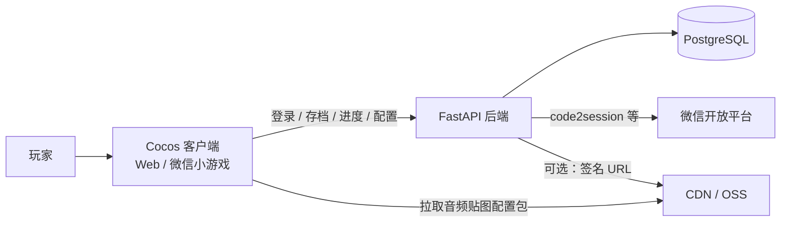
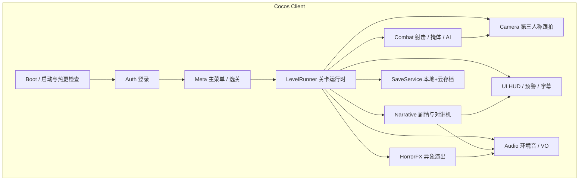
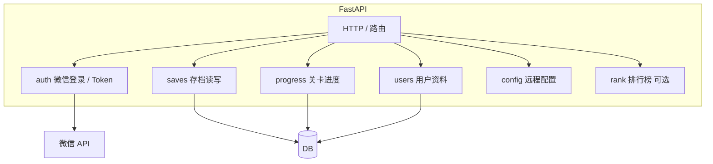

# 诡异弃子（Eerie Expendable）开发计划

> 版本：v1.1  
> 更新日期：2026-07-12  
> 中文名：**诡异弃子** · 英文名：**Eerie Expendable**  
> 仓库：[Eason-88/eerie-expendable](https://github.com/Eason-88/eerie-expendable)  
> 本地目录：`heiying`（技术路径，可与商品名不同）  
> 定位：微信小游戏（叙事恐怖射击）+ FastAPI 弱联网后端  
> 视角：伪 3D 第三人称跟拍（主参考：`assets/view-pseudo-3d.png`）  
> 主角呼号：黑鹰7号（游戏内代号，非商品名）

---

## 1. 产品与范围

### 1.1 一句话描述

你是反恐精英「黑鹰7号」。森林突袭中队友被撞死、对讲机只能接收；深入后遭遇诡异异象与空巢恐怖基地，最终被总部诬陷叛变，在支援到达后对战昔日队友。

### 1.2 第一版（MVP）范围

| 包含 | 不包含（后续再做） |
|------|-------------------|
| 单机关卡制叙事射击 | 实时联机对战 |
| 第一关完整三幕闭环 | 完整多结局大地图 |
| 本地进度 + 云端存档同步 | 重度商城 / 抽卡 |
| Cocos Web 预览调试 → 微信小游戏发布 | 普通业务小程序页为主入口 |
| 对讲机单向音频演出 | 语音实时通话 |

### 1.3 第一关三幕（玩法锚点）

```
幕 A 潜入异象     → 探索 / 氛围 / 触发诡异事件（猪头怪、稻草人仪式）
幕 B 空巢与狙击   → 掩体躲避 / 预警 UI / 抵达狙击位发现人去楼空
幕 C 叛变清剿     → 对讲机「清理黑鹰7号」→ 操控射击击毙友军 → 过关
```

目标单局时长：约 **8–15 分钟**。

### 1.4 创意参考

| 维度 | 参考 | 学什么 |
|------|------|--------|
| 叙事反转 | Spec Ops: The Line、部分 COD 战役 | 命令崩塌、被组织抛弃的压迫感 |
| 恐怖意象 | Resident Evil、寂静岭 | 废弃空间、非人死状、民俗仪式、短暂可见的异象 |
| 镜头氛围 | 本仓库 `assets/view-pseudo-3d.png` | 身后跟拍、纵深雾气、掩体可读性 |

---

## 2. 技术栈选型

### 2.1 总览

| 层级 | 技术 | 说明 |
|------|------|------|
| 游戏客户端 | **Cocos Creator 3.x** | 伪 3D 场景、战斗、剧情；浏览器预览 → 微信小游戏 |
| 后端 API | **Python FastAPI** | 登录、存档、进度、配置下发 |
| 数据库 | **PostgreSQL**（开发可用 SQLite） | 用户、存档、关卡进度 |
| 缓存（可选） | **Redis** | 会话、排行榜、限流；MVP 可暂缓 |
| 对象存储 / CDN | **腾讯云 COS / 阿里云 OSS + CDN** | 音频、大贴图、配置包 |
| 微信侧 | **微信小游戏 + 微信登录** | 正式分发与账号体系 |
| 运营后台（可选） | React 管理端 | 配置热更、数据查看；与玩法解耦 |
| 包管理 / 运行 | **`server/venv`** 虚拟环境 + pip（或 uv）；Cocos 编辑器 | 仅后端需要 venv；客户端不走 Python |

### 2.2 为何这样选

- **Cocos 而非 Unity**：伪 3D 跟拍能力足够；Web 预览 → 微信小游戏链路成熟、包体更易控。
- **FastAPI 而非 Go 游戏服**：当前为单机 + 弱联网存档，无实时帧同步需求；Python 迭代快。
- **关系库优先**：存档结构清晰、易查进度与关卡解锁；高并发实时服以后再拆。

### 2.3 运行与调试约定

```
日常开发：Cocos 编辑器 → Preview in Browser（类比网站本地预览）
联调后端：浏览器预览客户端 → http://localhost:8000（FastAPI）
微信验证：构建小游戏包 → 微信开发者工具 / 真机（触控、性能、包体）
```

---

## 3. 模块间关系

### 3.1 系统上下文



### 3.2 客户端内部模块



### 3.3 后端内部模块



### 3.4 模块职责与依赖规则

| 模块 | 职责 | 允许依赖 | 禁止 |
|------|------|----------|------|
| `Camera` | 跟拍、遮挡处理、镜头震动 | 输入、角色 Transform | 直接改关卡逻辑 |
| `Combat` | 射击、受伤、掩体、敌人 AI | Camera、Audio、UI 事件 | 直接写存档 |
| `Narrative` | 对讲机 VO、字幕、剧情触发器 | Audio、UI、Level 事件总线 | 直接生成敌人 |
| `HorrorFX` | 异象出现/消失、闪现、仪式演出 | Audio、Camera 短时接管 | 长期占用战斗输入 |
| `SaveService` | 序列化进度、本地缓存、调用 API | 网络层 | 依赖具体关卡脚本细节 |
| `LevelRunner` | 三幕状态机、胜负结算 | 上述玩法模块 | 直接调微信 SDK（经平台适配层） |
| 后端 `saves` | 存档 CRUD、版本冲突策略 | DB、auth | 嵌入关卡脚本逻辑 |

**原则**：玩法模块之间通过 **事件总线 / 消息** 解耦；平台差异（Web / 微信）收敛在 `platform/` 适配层。

---

## 4. 仓库目录结构（Tree）

目标为 **单体仓库 Monorepo**：客户端、后端、文档、美术参考分区清晰。

```text
heiying/
├── README.md
├── docs/
│   ├── 开发计划.md                 # 本文档
│   ├── 玩法设计-第一关.md           # （后续补充）
│   └── API约定.md                  # （后续补充）
├── assets/                         # 非引擎资源参考（概念图等）
│   └── view-pseudo-3d.png          # 伪 3D 主视觉参考（重点保留）
├── client/                         # Cocos Creator 3 工程根目录
│   ├── package.json
│   ├── tsconfig.json
│   ├── settings/
│   ├── profiles/
│   ├── assets/
│   │   ├── scenes/
│   │   │   ├── boot.scene
│   │   │   ├── meta.scene
│   │   │   └── level_01.scene
│   │   ├── scripts/
│   │   │   ├── core/               # 事件总线、状态机、对象池
│   │   │   ├── platform/           # Web / 微信适配
│   │   │   ├── net/                # HTTP 客户端、鉴权头
│   │   │   ├── save/               # 本地存档 + 云同步
│   │   │   ├── camera/             # 第三人称跟拍
│   │   │   ├── combat/             # 角色、武器、子弹、AI、掩体
│   │   │   ├── narrative/          # 对讲机、剧情触发器、字幕
│   │   │   ├── horror/             # 异象 FX
│   │   │   ├── level/              # 关卡状态机（三幕）
│   │   │   ├── ui/                 # HUD、预警、暂停
│   │   │   └── audio/              # BGM / SFX / VO
│   │   ├── prefabs/
│   │   ├── materials/
│   │   ├── models/
│   │   ├── textures/
│   │   ├── audio/
│   │   ├── config/                 # 本地默认 JSON（可被远端覆盖）
│   │   └── resources/              # 动态加载资源
│   └── build-templates/
│       └── wechatgame/             # 微信小游戏构建模板
├── server/                         # FastAPI 后端
│   ├── venv/                       # Python 虚拟环境（本地创建，不进 Git）
│   ├── pyproject.toml
│   ├── .env.example
│   ├── app/
│   │   ├── main.py
│   │   ├── core/                   # 配置、安全、依赖注入
│   │   │   ├── config.py
│   │   │   ├── security.py
│   │   │   └── deps.py
│   │   ├── api/
│   │   │   └── v1/
│   │   │   │   ├── router.py
│   │   │   │   ├── auth.py
│   │   │   │   ├── saves.py
│   │   │   │   ├── progress.py
│   │   │   │   └── config.py
│   │   ├── models/                 # SQLAlchemy / SQLModel
│   │   ├── schemas/                # Pydantic
│   │   ├── services/
│   │   └── db/
│   │       ├── base.py
│   │       └── session.py
│   ├── alembic/                    # 迁移
│   └── tests/
├── tools/                          # 可选：配置校验、资源压缩脚本
└── .gitignore
```

### 4.1 目录约定补充

- **客户端业务脚本只放 `client/assets/scripts/`**，按域分包，禁止「巨型 `GameManager.ts` 包办一切」。
- **关卡数据**（刷怪波次、剧情时间轴）优先 JSON/配置，少写死在代码里。
- **后端对外 API 一律挂在 `/api/v1/`**，破坏性变更升 v2。
- **概念图、策划文档** 不进 Cocos `assets/`，放仓库根 `assets/` 与 `docs/`，避免进包体。

---

## 5. 分阶段开发计划

### 阶段 0：工程奠基（约 3–5 天）

**目标**：仓库可运行、规范落地、伪 3D 相机能跑通空场景。  
**进度**：进行中（后端与脚本已就绪；Cocos 编辑器工程待本机安装后补齐）。详见 [`阶段0-验收说明.md`](./阶段0-验收说明.md)。

| 任务 | 产出 | 状态 |
|------|------|------|
| 创建 Cocos 3 工程于 `client/` | 浏览器可 Preview | ⏳ 脚本+web-preview 已就绪；正式工程待 Creator |
| 搭建 FastAPI 骨架于 `server/`（使用 **`venv`**） | `GET /health` 可用 | ✅ |
| 第三人称跟拍原型 | 角色前后移动时相机跟随，带轻度雾 | ✅（web-preview + Cocos 脚本） |
| 平台适配空壳 | `platform/web.ts` / `platform/wechat.ts` | ✅ |
| 文档与规范 | 本文档 + Ruff；Cocos ESLint 随编辑器工程补 | ✅ / 部分 |

**验收**：浏览器中可控制胶囊体在简易森林地板行走；后端 health 通。

---

### 阶段 1：战斗与关卡骨架（约 1.5–2.5 周）

**目标**：可玩的「走、藏、射」，无完整剧情也可反复测手感。  
**进度**：✅ 可验收（`web-preview` 测试关）。详见 [`阶段1-验收说明.md`](./阶段1-验收说明.md)。

| 任务 | 产出 | 状态 |
|------|------|------|
| 角色移动 / 瞄准 / 射击 | 命中判定、弹孔或受击反馈 | ✅ |
| 掩体系统 | 可进入掩体、露头射击 | ✅ |
| 基础敌人 AI | 警戒、射击、被击倒 | ✅ |
| 关卡状态机空壳 | `Explore / Sniper / Betrayal / Win` | ✅ |
| 简易 HUD | 血量、弹药、受击提示 | ✅ |
| 对象池 | 子弹、特效复用 | ✅ |

**验收**：一块测试关内可清完一小波敌人并结算胜利。

---

### 阶段 2：第一关三幕内容（约 2–3 周）

**目标**：完整第一关叙事闭环（MVP 核心）。  
**进度**：✅ 可验收（`web-preview` 战役）。详见 [`阶段2-验收说明.md`](./阶段2-验收说明.md)。

| 幕 | 任务 | 状态 |
|----|------|------|
| A | 废弃列车猪头怪常驻，开枪驱散；稻草人仪式常驻，开枪或靠近驱散 | ✅ |
| B | 狙击手弹道预警 + 掩体躲避；抵达点位发现空位 | ✅ |
| C | 对讲机「黑鹰7号已叛变」；友军敌对化；清剿完毕过关 | ✅ |
| 通用 | 对讲机只能接收的 UI/音频规则；总部催促循环 VO | ✅ |

**验收**：生玩家可在 8–15 分钟内通关；异象与反转可感知。

---

### 阶段 3：存档、后端与微信（约 1.5–2 周）

**目标**：弱联网闭环 + 可提交体验版。

| 任务 | 产出 |
|------|------|
| 本地存档 | 关卡进度、检查点、设置 |
| FastAPI：微信登录 / 测试登录 | JWT 或等价 Token |
| 云存档同步 | 冲突策略（时间戳 / 版本号） |
| 远程配置 | 难度、VO 开关等 |
| 微信小游戏构建 | 分包、首包体积达标 |
| CDN | 大音频与贴图外置 |

**验收**：换设备（或清缓存后登录）可拉回进度；开发者工具可跑通关。

---

### 阶段 4：打磨与内容扩展（持续）

| 方向 | 内容 |
|------|------|
| 手感 | 后坐力、受击硬直、镜头震动、难度曲线 |
| 表现 | 雾、脚步、环境音、死亡演出 |
| 性能 | Draw call、阴影策略、微信真机帧率 |
| 关卡 2+ | 新异象、新敌人规则（仍保持弱联网） |
| 运营 | 简易排行榜、崩溃日志、配置热更 |

---

### 阶段依赖关系

```text
阶段 0 工程奠基
    └─► 阶段 1 战斗骨架
            └─► 阶段 2 第一关三幕 ──┬─► 阶段 3 存档/微信
                                   └─► 阶段 4 打磨扩展
```

阶段 2 与阶段 3 可部分并行（剧情内容 vs 登录存档），但 **过关结算写入存档** 需在阶段 3 接口就绪后联调。

---

## 6. 代码规范

### 6.1 通用原则

1. **可读性优于炫技**：命名表达意图；避免无必要抽象。
2. **单一职责**：一个脚本/模块只做一类事。
3. **配置与逻辑分离**：数值、时间轴、刷怪进 JSON/配置表。
4. **平台无关玩法**：微信 API 只出现在 `platform/`。
5. **禁止提交密钥**：`.env`、微信密钥、COS 密钥不进 Git。
6. **改动最小化**：不顺手大重构无关文件。

### 6.2 客户端（TypeScript / Cocos）

| 项 | 约定 |
|----|------|
| 语言 | TypeScript 严格模式（`strict: true`） |
| 命名 | 类/组件 `PascalCase`；方法/变量 `camelCase`；常量 `UPPER_SNAKE` |
| 文件 | 一文件一主类；文件名与类名一致，如 `ThirdPersonCamera.ts` |
| 组件 | 继承 `Component` 的玩法逻辑放对应域目录 |
| 事件 | 跨模块通信用事件总线或明确接口，少直接互相 `find` 场景节点 |
| 生命周期 | 在 `onDestroy` 取消事件监听与调度，避免泄漏 |
| 魔法数 | 禁止散落；抽到配置或 `readonly` 常量 |
| 日志 | 开发用统一 `Logger`；发布包关闭调试日志 |
| 注释 | 只注释「为什么」；不写废话式注释 |

**示例（推荐结构）：**

```ts
// client/assets/scripts/camera/ThirdPersonCamera.ts
import { _decorator, Component, Node, Vec3 } from 'cc';
const { ccclass, property } = _decorator;

@ccclass('ThirdPersonCamera')
export class ThirdPersonCamera extends Component {
  @property(Node)
  target: Node | null = null;

  @property
  followDistance = 8;

  update(dt: number) {
    // ...
  }
}
```

### 6.3 后端（Python / FastAPI）

| 项 | 约定 |
|----|------|
| 风格 | 遵循 Ruff / Black 等价规则；`snake_case` |
| 类型 | 函数参数与返回值标注类型；Pydantic 做 I/O |
| 分层 | `api` → `services` → `models`；路由内不写复杂业务 |
| API | RESTful；统一响应包或明确 HTTP 状态码 |
| 错误 | 业务错误用明确异常 / `HTTPException`；不吞异常 |
| 异步 | IO 密集用 `async`；避免在 async 中跑重 CPU 阻塞 |
| 迁移 | Schema 变更走 Alembic，禁止手改生产库 |
| 测试 | 关键存档/登录路径有 pytest 覆盖 |

**API 路径示例：**

```text
POST /api/v1/auth/wechat      # 登录换 Token
GET  /api/v1/saves/current    # 拉取存档
PUT  /api/v1/saves/current    # 上传存档
GET  /api/v1/progress         # 关卡进度
GET  /api/v1/config/client    # 客户端远程配置
GET  /health                  # 探活
```

### 6.4 Git 与提交

- 分支：`main` 稳定；功能分支 `feat/*`；修复 `fix/*`。
- 提交信息：简洁说明「为什么」，如 `feat: 第一关叛变阶段友军敌对化`。
- 不提交：`library/`、本地 `temp/`、`node_modules/`、`.env`、巨大原始扫描件。
- 大资源：优先 CDN；仓库内仅保留必要源文件与压缩后进包资源。

### 6.5 游戏向专项规范

1. **帧率假设**：逻辑勿绑死 60fps；用 `dt`。
2. **对象池**：子弹、击中特效必须池化。
3. **遮挡与镜头**：跟拍相机优先保证角色与威胁可读，再追求电影感。
4. **异象演出**：Horror 可短时接管镜头，结束后必须归还 Combat 输入。
5. **对讲机规则**：全局标志 `radioCanTransmit = false`（第一关）；UI 禁止出现「按键说话」误导。
6. **微信包体**：首包控制；音频/高模走分包或 CDN。
7. **存档兼容**：存档带 `schemaVersion`；读档需迁移策略。

### 6.6 Code Review 检查清单（节选）

- [ ] 是否把微信/浏览器 API 写进了玩法脚本？
- [ ] 是否新增未配置化的魔法数？
- [ ] 事件监听是否成对注销？
- [ ] 存档字段是否有版本号？
- [ ] 是否引入密钥或本机绝对路径？

---

## 7. 风险与对策

| 风险 | 对策 |
|------|------|
| 微信真机性能不足 | 降阴影、减树密度、烘培光照；预留画质档 |
| 伪 3D 遮挡导致枪战难读 | 半透遮挡、相机碰撞、威胁指示器 |
| 叙事节奏拖沓 | 单局 8–15 分钟硬指标；异象点到为止 |
| 存档冲突 | 版本号 + 服务器权威；客户端合并策略写清 |
| 范围膨胀 | MVP 只做第一关三幕；联机不做 |

---

## 8. 当前决议备忘（锁定）

```text
商品名：   诡异弃子 / Eerie Expendable
仓库：     github.com/Eason-88/eerie-expendable
呼号：     黑鹰7号（角色代号）
后端：     FastAPI + 关系库 + CDN（进度存档优先）
客户端：   Cocos Creator 3（Web 预览 → 微信小游戏）
运营后台： React（可选）
视角：     伪 3D 第三人称跟拍（参考 assets/view-pseudo-3d.png）
叙事参考： Spec Ops / 部分 COD
恐怖参考： RE / 寂静岭意象
联机：     第一版不做实时对战
```

---

## 9. 后续文档清单

| 文档 | 状态 | 说明 |
|------|------|------|
| `docs/开发计划.md` | 已完成 | 本文档 |
| `docs/阶段0-验收说明.md` | 已完成 | 阶段 0 启动与验收 |
| `docs/阶段1-验收说明.md` | 已完成 | 战斗测试关操作与验收 |
| `docs/阶段2-验收说明.md` | 已完成 | 第一关三幕流程与验收 |
| `docs/玩法设计-第一关.md` | 待写 | 三幕节拍、敌人波次、VO 列表 |
| `docs/API约定.md` | 待写 | 请求/响应 JSON Schema |
| `docs/美术与镜头规范.md` | 待写 | 基于伪 3D 参考图的制作约束 |

---

*本文档随阶段推进可修订版本号；选型变更须同步更新第 2 节与第 8 节。*
